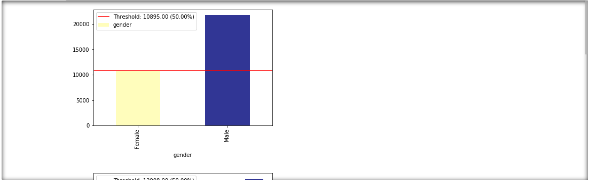
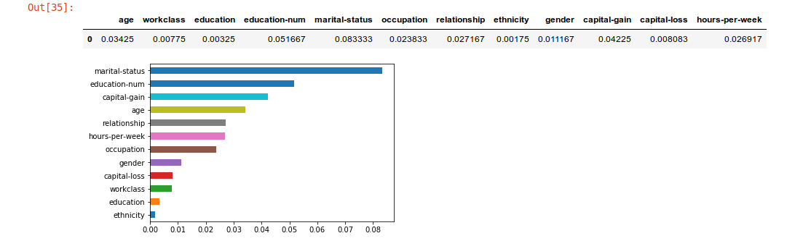
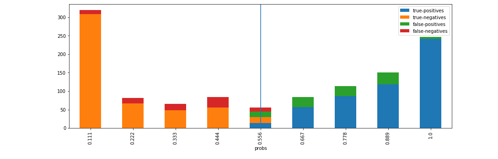

[](https://GitHub.com/Naereen/StrapDown.js/graphs/commit-activity)

# XAI - An eXplainability toolbox for machine learning 

XAI is a Machine Learning library that is designed with AI explainability in its core. XAI contains various tools that enable for analysis and evaluation of data and models. The XAI library is maintained by [The Institute for Ethical AI & ML](http://ethical.institute/), and it was developed based on the [8 principles for Responsible Machine Learning](http://ethical.institute/principles.html).

You can find the documentation at [https://ethicalml.github.io/xai/index.html](https://ethicalml.github.io/xai/index.html). You can also check out our [talk at Tensorflow London](https://www.youtube.com/watch?v=GZpfBhQJ0H4) where the idea was first conceived - the talk also contains an insight on the definitions and principles in this library.

# 0.0.4 - ALPHA Version

This library is currently in early stage developments and hence it will be quite unstable due to the fast updates. It is important to bare this in mind if using it in production. 

## What do we mean by eXplainable AI?

We see the challenge of explainability as more than just an algorithmic challenge, which requires a combination of data science best practices with domain-specific knowledge. The XAI library is designed to empower machine learning engineers and relevant domain experts to analyse the end-to-end solution and identify discrepancies that may result in sub-optimal performance relative to the objectives required. More broadly, the XAI library is designed using the 3-steps of explainable machine learning, which involve 1) data analysis, 2) model evaluation, and 3) production monitoring. 

We provide a visual overview of these three steps mentioned above in this diagram:


# XAI Quickstart

## Installation

The XAI package is on PyPI. To install you can run:

```
pip install xai
```

Alternatively you can install from source by cloning the repo and running:

```
python setup.py install 
```

## Usage

You can find example usage in the examples folder.

### 1) Data Analysis

With XAI you can identify imbalances in the data. For this, we will load the census dataset from the XAI library.

``` python
import xai.data
df = xai.data.load_census()
df.head()
```


#### View class imbalances for protected columns
``` python
protected_cols = ["gender", "ethnicity", "age"]
ims = xai.show_imbalances(df, protected_cols)
```


#### View imbalance of one column
``` python
im = xai.show_imbalance(df, "gender")
```


#### View imbalance of one column intersected with another
``` python
im = xai.show_imbalance(df, "gender", cross=["loan"])
```


#### Balance the class using upsampling and/or downsampling
``` python
bal_df = xai.balance(df, "gender", cross=["loan"], upsample=1.0)
```


#### Create a balanced test-train split (should be done pre-balancing)
``` python
# Balanced train-test split with minimum 300 examples of 
# the cross of the target y and the column gender
x_train, y_train, x_test, y_test = xai.balanced_train_test_split(
            x, y, cross=["gender"], 
            categorical_cols=categorical_cols, min_per_class=300)

# Visualise the imbalances of gender and the target 
df_test = x_test.copy()
df_test["loan"] = y_test
_= xai.show_imbalance(df_test, "gender", cross=["loan"], categorical_cols=categorical_cols)
```


### 2) Model Evaluation

We are able to also analyse the interaction between inference results and input features. For this, we will train a single layer deep learning model.

```
model = build_model(proc_df.drop("loan", axis=1))

model.fit(f_in(x_train), y_train, epochs=50, batch_size=512)

probabilities = model.predict(f_in(x_test))
predictions = list((probabilities >= 0.5).astype(int).T[0])
```


#### Visualise permutation feature importance
``` python
def get_avg(x, y):
    return model.evaluate(f_in(x), y, verbose=0)[1]

imp = xai.feature_importance(x_test, y_test, get_avg)

imp.head()
```


#### Identify metric imbalances against all test data
``` python
_= xai.metrics_imbalance(
        x_test, 
        y_test, 
        probabilities)
```


#### Identify metric imbalances grouped by protected columns
``` python
_= xai.metrics_imbalances(
        x_test, 
        y_test, 
        probabilities,
        columns=protected,
        categorical_cols=categorical_cols)
```


#### Visualise the ROC curve against all test data
``` python
_= xai.roc_imbalance(
    x_test, 
    y_test, 
    probabilities)
```


#### Visualise the ROC curves grouped by protected columns
``` python
_= xai.roc_imbalances(
    x_test, 
    y_test, 
    probabilities, 
    columns=protected,
    categorical_cols=categorical_cols)
```


#### Visualise the precision-recall curve by protected columns
``` python
_= xai.pr_imbalances(
    x_test, 
    y_test, 
    probabilities, 
    columns=protected,
    categorical_cols=categorical_cols)
```


#### Visualise accuracy grouped by probability buckets
``` python
d = xai.smile_imbalance(
    y_test, 
    probabilities)
```


#### Visualise statistical metrics grouped by probability buckets
``` python
d = xai.smile_imbalance(
    y_test, 
    probabilities,
    display_breakdown=True)
```


#### Visualise benefits of adding manual review on probability thresholds
``` python
d = xai.smile_imbalance(
    y_test, 
    probabilities,
    bins=9,
    threshold=0.75,
    manual_review=0.375,
    display_breakdown=False)
```


